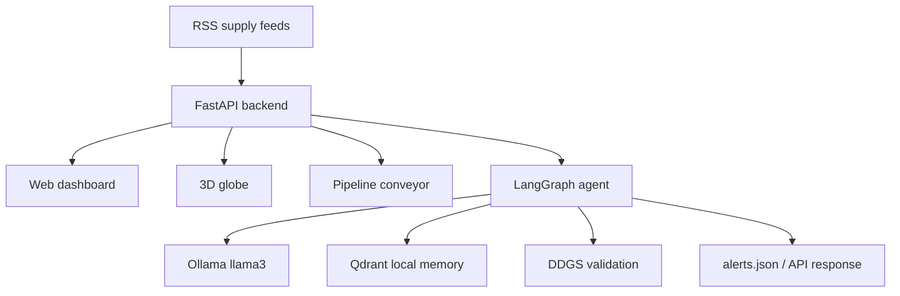

# SupplySentry / GlobalSentry

SupplySentry is a supply-chain risk intelligence website built for the Google Solution Challenge. It serves a live web dashboard, an India-focused RSS feed, a 3D threat globe, and an Ollama-powered agent pipeline that analyzes supply disruption headlines with local RAG memory.

The current deployment is focused on **Supply-Sentry** for **SDG 12: Responsible Consumption and Production**.

## What It Does

- Tracks supply-chain disruption news from RSS feeds.
- Runs suspicious headlines through a local LangGraph agent pipeline.
- Uses Ollama with `llama3` for local analysis, with no cloud LLM key required.
- Uses Qdrant local storage as RAG memory for past events.
- Fact-checks and validates claims with DuckDuckGo search through `ddgs`.
- Serves the website and API from one FastAPI app.
- Includes a dashboard, pipeline/conveyor view, and 3D globe threat map.

## Current Architecture



## Agent Pipeline

The live agent is in `Radio/sentry.py` and is called by `GlobalSentry-Web/api.py`.

| Step | Node | Purpose |
| --- | --- | --- |
| 1 | Profiler | Scores relevance against the stakeholder profile. |
| 2 | Triage | Filters out headlines that are not supply-chain threats. |
| 3 | Retriever | Looks up related supply events from Qdrant memory. |
| 4 | Analyst | Produces severity, confidence, and impact analysis. |
| 5 | Locator | Extracts likely affected geography when possible. |
| 6 | Correlator | Checks memory for related risks from older stored events. |
| 7 | Validator | Searches live web results to verify the claim. |
| 8 | Notify | Formats the alert for the API/dashboard. |
| 9 | Archiver | Stores the event back into Qdrant memory. |

Note: some internal code still has historical hooks for `epi` and `eco`, but the current website and deployment are locked to `supply`.

## Project Layout

```text
.
├── GlobalSentry-Web/
│   ├── api.py                  # FastAPI backend and static website server
│   ├── requirements.txt        # Web/API dependencies
│   └── frontend/               # Dashboard, globe, conveyor, CSS, JS
├── Radio/
│   ├── sentry.py               # Ollama + LangGraph + Qdrant agent
│   ├── ingest.py               # RSS ingestion runner
│   ├── seed_data.py            # Optional memory seeding
│   └── requirements.txt        # Agent dependencies
├── Dockerfile                  # Production image for website/backend/agent code
├── docker-compose.yml          # Website + Ollama deployment
├── DEPLOYMENT.md               # Server deployment walkthrough
└── README.md
```

## Requirements

- Python 3.11+
- Ollama installed locally or available through Docker Compose
- `llama3` pulled in Ollama
- Docker and Docker Compose for server deployment

## Local Development

Install dependencies:

```bash
cd GlobalSentry-Web
pip install -r requirements.txt

cd ../Radio
pip install -r requirements.txt
```

Start Ollama:

```bash
ollama pull llama3
ollama serve
```

Start the website/backend:

```bash
cd GlobalSentry-Web
python -m uvicorn api:app --host 0.0.0.0 --port 8000
```

Open:

- Website: `http://localhost:8000`
- 3D globe: `http://localhost:8000/globe.html`
- Conveyor: `http://localhost:8000/conveyor.html`
- API docs: `http://localhost:8000/api/docs`

## Test The Agent

Trigger a live SupplySentry analysis:

```bash
curl -X POST http://localhost:8000/api/trigger \
  -H "Content-Type: application/json" \
  -d '{"headline":"Major port strike disrupts container shipments in Mumbai and delays pharmaceutical exports","mode":"supply"}'
```

The response should include:

```json
{
  "status": "analysis_complete",
  "engine": "live_agent"
}
```

If Ollama is not running, the backend may fall back to demo/RSS behavior instead of the live agent.

## API Endpoints

| Endpoint | Purpose |
| --- | --- |
| `GET /api/status` | Backend and active mode status. |
| `GET /api/alerts` | Current enriched supply alerts. |
| `GET /api/feed/supply` | Raw paginated supply RSS feed. |
| `GET /api/globe-threats` | Threat data for the globe map. |
| `POST /api/trigger` | Manually run one headline through the agent. |
| `GET /api/docs` | FastAPI Swagger documentation. |

## Docker Deployment

This branch can deploy with a hosted LLM provider instead of Ollama. For the API-key deployment path, set:

```bash
LLM_PROVIDER=groq
GROQ_API_KEY=your_groq_key
GROQ_MODEL=llama-3.1-8b-instant
```

The older Ollama deployment path uses Docker Compose to run:

- `ollama`
- `ollama-pull`, which pulls the configured model
- `globalsentry-web`, which serves the FastAPI website and agent backend

Start it on a server:

```bash
docker compose up -d --build
```

Then open:

```text
http://YOUR_SERVER_IP:8000
```

For the full server walkthrough, see [DEPLOYMENT.md](DEPLOYMENT.md).

## Environment Variables

| Variable | Default | Purpose |
| --- | --- | --- |
| `LLM_PROVIDER` | `groq` in this branch's Docker image, `ollama` locally unless set | Chooses `groq` or `ollama`. |
| `GROQ_API_KEY` | unset | Required when `LLM_PROVIDER=groq`. Do not commit this. |
| `GROQ_MODEL` | `llama-3.1-8b-instant` | Groq-hosted model for the cloud branch. |
| `OLLAMA_MODEL` | `llama3` | Ollama model used by the agent. |
| `OLLAMA_BASE_URL` | `http://localhost:11434` locally, `http://ollama:11434` in Docker | Ollama API URL. |
| `QDRANT_PATH` | `./qdrant_data` locally, `/data/qdrant` in Docker | Local Qdrant persistence path. |

## Tech Stack

| Layer | Technology |
| --- | --- |
| Backend | FastAPI, Uvicorn |
| Frontend | HTML, CSS, JavaScript |
| 3D map | Three.js |
| Agent orchestration | LangGraph, LangChain |
| LLM | Groq API on this branch, Ollama + Llama 3 on the local demo branch |
| Memory | Qdrant local vector storage |
| Embeddings | `all-MiniLM-L6-v2` |
| Validation search | DDGS |
| Deployment | Docker, Docker Compose |

## SDG Alignment

SupplySentry supports **SDG 12: Responsible Consumption and Production** by detecting supply disruptions early, surfacing possible regional impact, and helping users reason about logistics risk, supplier exposure, and continuity planning.

## Status

Current focus:

- Supply-chain intelligence website
- Local Ollama-powered analysis
- Qdrant RAG memory
- Docker deployment

Historical prototype ideas for broader multi-domain monitoring may still exist in some files, but they are not the main deployed experience right now.
