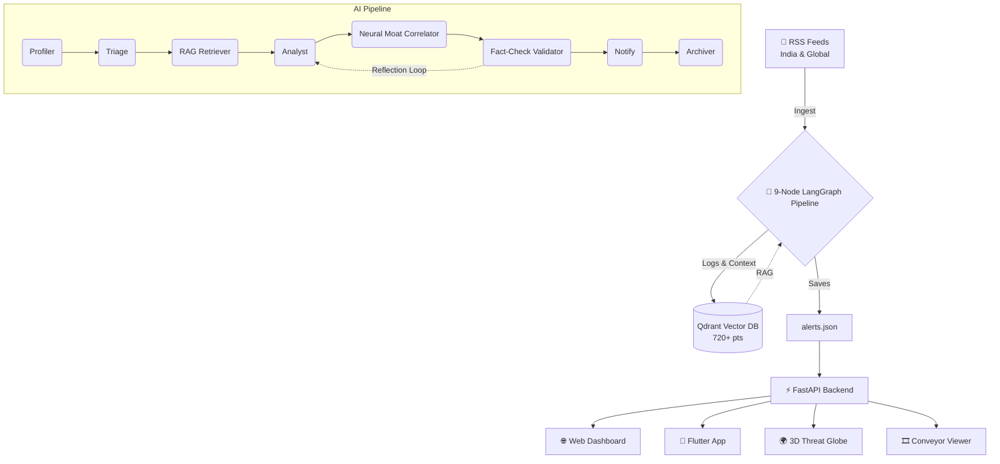

<div align="center">

# 🛡️ GlobalSentry

**Real-time global threat detection across epidemics, climate disasters, and supply chain disruptions — powered by a self-correcting AI pipeline running 100% locally.**

[](https://python.org)
[](https://fastapi.tiangolo.com)
[](https://github.com/langchain-ai/langgraph)
[](https://ollama.com)
[](https://flutter.dev)
[](https://qdrant.tech)

🏆 **Built for HackXtreme Hackathon** 🏆

[Architecture](#%EF%B8%8F-architecture) • [Features](#-key-features) • [Quick Start](#-quick-start) • [Tech Stack](#%EF%B8%8F-tech-stack) • [SDG Alignment](#-sdg-alignment)

</div>

---

## 🧠 What is GlobalSentry?

GlobalSentry is an **autonomous threat intelligence platform** that ingests live RSS feeds from Indian and global news sources, runs them through a **9-node multi-agent AI pipeline**, and surfaces actionable alerts across three critical domains:

| Mode | Domain | SDG Focus | Example Threats |
|:---:|:---|:---:|:---|
| 🩺 **Epi-Sentry** | Public Health | SDG 3 | Cholera outbreaks, Nipah virus clusters, dengue surges |
| 🌪️ **Eco-Sentry** | Climate & Disasters | SDG 11 & 13 | Floods, earthquakes, cyclones, heatwaves, GLOFs |
| ♻️ **Supply-Sentry** | Supply Chain | SDG 12 | Port congestion, chip shortages, pharma API disruptions |

> [!IMPORTANT]  
> **💡 Key Innovation: The Neural Moat**  
> GlobalSentry's cross-mode correlator detects **cascading risks between domains** that single-domain systems miss.  
> *Example: A flood in Bangladesh (🌪️ Eco) → triggers cholera outbreak (🩺 Epi) → disrupts garment supply chain (♻️ Supply).*  
> This convergence detection is powered by cross-domain vector similarity search in Qdrant, making it the platform's core differentiator.

---

## 🏗️ Architecture



### The 9-Node Pipeline

| # | Node | Role | Details |
|---|------|------|---------|
| 1 | Profiler | Relevance scoring | Scores news against stakeholder profile (region, role, interests). |
| 2 | Triage | Threat classifier | Mode-aware YES/NO filter — drops irrelevant noise fast. |
| 3 | Retriever | RAG context | Queries Qdrant for same-mode historical events. |
| 4 | Analyst | Deep analysis | Domain expert analysis — outputs severity (1–5) + confidence (0–1). |
| 5 | Correlator | 🧠 Neural Moat | Cross-mode vector search — finds cascading risks between EPI ↔ ECO ↔ SUPPLY. |
| 6 | Validator | Fact-checker | Verifies claims via live DuckDuckGo search. |
| 7 | Retry Counter | Reflection loop | If unverified, routes back to Analyst with new evidence (max 1 retry). |
| 8 | Notify | Alert dispatcher | Saves structured alert to alerts.json for the web dashboard. |
| 9 | Archiver | Memory builder | Stores event + metadata in Qdrant for future RAG and correlation. |

---

## ✨ Key Features
- **🤖 Autonomous Scanning**: Background loop continuously ingests RSS feeds and runs them through the AI pipeline.
- **🧠 Cross-Domain Correlation**: Neural Moat detects cascading risks across EPI ↔ ECO ↔ SUPPLY domains.
- **🔄 Self-Correcting Reflection Loop**: Validator can reject an analysis and send it back to the Analyst with new evidence.
- **🌍 3D Threat Globe**: Interactive Three.js globe showing geo-located threats with severity-colored markers.
- **🎞️ Live Conveyor View**: Real-time pipeline visualization showing each headline flowing through AI nodes.
- **📱 Flutter Mobile App**: Cross-platform companion app with alert details, analytics, and pipeline views.
- **🔒 100% Local**: Runs entirely on local hardware — Ollama (Llama 3), local embeddings, local Qdrant — zero cloud APIs.

---

## 🚀 Quick Start

> [!NOTE]
> Prerequisites: Make sure you have Python 3.11+, Ollama (with Llama 3), and optionally Flutter installed.

### 1. Start Ollama
```bash
ollama pull llama3
ollama serve
```

### 2. Setup the Agent Engine
```bash
cd Radio
pip install -r requirements.txt
cp .env.template .env # Edit if needed
python seed_data.py   # Seeds 18 demo events into Qdrant
```

### 3. Start the Web Dashboard
```bash
cd GlobalSentry-Web
pip install -r requirements.txt
uvicorn api:app --port 8000
```

### 4. Access the Platform
- 🌐 Dashboard: http://localhost:8000
- 🌍 3D Globe: http://localhost:8000/globe.html
- 🎞️ Conveyor: http://localhost:8000/conveyor.html
- 📄 API Docs: http://localhost:8000/api/docs

### 5. (Optional) Run the Flutter App:
```bash
cd global_sentry_app
flutter pub get
flutter run
```

---

## 🖼️ Gallery
*(Replace the placeholder links below with actual paths to your screenshots, e.g., ./docs/dashboard.png)*
<div align="center">


</div>

---

## 🛠️ Tech Stack

| Layer | Technology | Why We Chose It |
|-------|------------|-----------------|
| LLM | Ollama + Llama 3 | 100% local, no API keys, fast inference. |
| Agent Orchestration | LangGraph + LangChain | Stateful multi-agent DAG with conditional routing. |
| Vector Database | Qdrant (local) | Cosine similarity search, cross-mode correlation. |
| Embeddings | all-MiniLM-L6-v2 | Local sentence embeddings (384 dim), completely offline. |
| Backend API | FastAPI + Uvicorn | Async, auto-docs, serves both API and static frontend. |
| Web Frontend | Vanilla HTML/CSS/JS | Lightweight, no build step, glassmorphism dark theme. |
| 3D Globe | Three.js + WebGL | Interactive geo-visualization of threats. |
| Mobile App | Flutter + Dart | Cross-platform companion app. |
| Web Search | DuckDuckGo (DDGS) | Free, no API key — used by Validator for fact-checking. |

---

## 🌍 SDG Alignment
GlobalSentry directly addresses key UN Sustainable Development Goals:
- 🩺 **SDG 3 (Good Health)**: Epi-Sentry detects disease outbreaks early, enabling faster public health response.
- 🌪️ **SDG 11 (Sustainable Cities)**: Eco-Sentry monitors climate disasters for urban safety.
- ♻️ **SDG 12 (Responsible Consumption)**: Supply-Sentry tracks supply chain disruptions and ESG violations.
- 🌍 **SDG 13 (Climate Action)**: Cross-domain correlation reveals how climate events cascade into health and economic crises.

<br>
<div align="center">
<p>Built with ❤️ for <b>HackXtreme</b>.</p>
<p><i>Because threats don't stay in silos. Neither should intelligence.</i></p>
</div>
